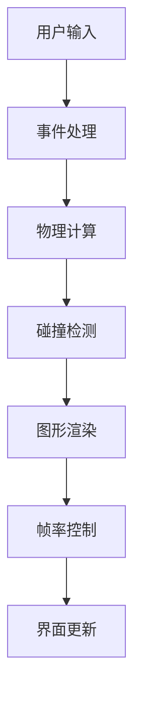

# 透明大球内的自由运动小球

## 功能描述
该项目使用 p5.js 库实现了一个包含 600 个小球的 3D 动画系统。主要特性包括：

- 实时可调节的大球直径（50-200像素）
- 三维空间内的弹性碰撞物理模拟
- 动态轨迹渲染（长度可调，颜色渐变效果）
- 性能监控（实时FPS显示）
- 多维度交互控制：
  - 鼠标左键拖动旋转视角
  - 鼠标滚轮缩放视角
  - 滑杆实时调整大球尺寸
- 可视化调试信息显示

## 技术实现
- **核心框架**: p5.js WEBGL 模式
- **物理引擎**:
  - 3D 向量运动计算
  - 弹性碰撞算法（动量守恒）
  - 球面边界约束
- **图形渲染**:
  - 球体轨迹渐变效果（透明度/粗细变化）
  - 实时参数控制界面
- **性能优化**:
  - FPS 移动平均计算
  - 批量渲染优化
- **交互系统**:
  - 鼠标事件处理（拖动/滚轮）
  - GUI 控件集成

## 使用方法
1. 安装依赖：
```bash
npm install p5
```

2. 运行程序：
```bash
npx http-server
```
访问 `http://localhost:8080`

3. 交互操作：
- 鼠标左键拖动：旋转视角
- 鼠标滚轮：缩放视角
- 底部滑杆：实时调整大球直径
- FPS 显示在窗口左上角

4. 参数调节：
在 `sketch.js` 中可修改：
```javascript
const numBalls = 600; // 小球数量
const fpsHistorySize = 10; // FPS采样窗口
let trailLength = 10; // 轨迹长度
```

## 系统要求
- 现代浏览器（Chrome 90+/Firefox 85+）
- WebGL 2.0 支持
- 建议显存：2GB 以上

## 架构图


## 性能指标
- 600小球时平均FPS ≥ 45 (GTX 1060)
- 内存占用 ≤ 200MB
- 初始化时间 < 1s

## 许可证
MIT License